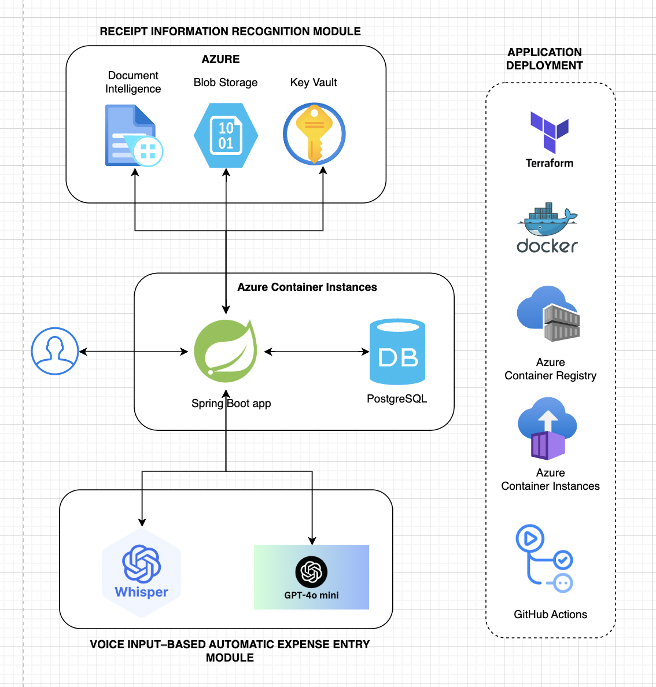
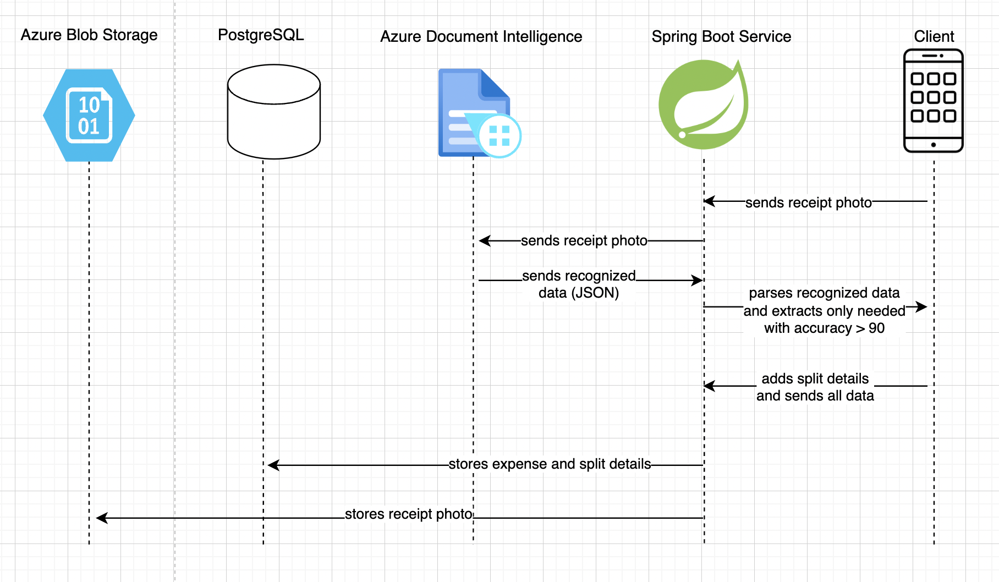
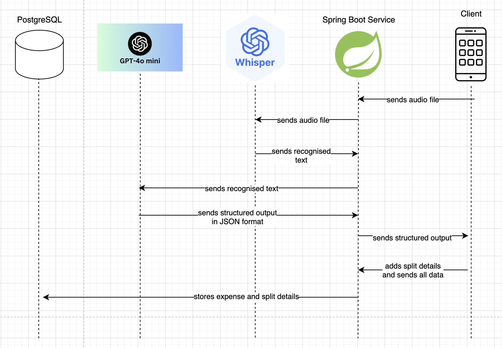

### TOPIC:
#### DEVELOPMENT OF A BACKEND WITH AN EMBEDDED TEXT RECOGNITION MODULE FOR IMAGES IN A MOBILE APPLICATION FOR GROUP EXPENSE MANAGEMENT

#### Author: 
Yuliia Pnivchuk
#### Scientific Supervisor: 
Rostyslav O. Hrynyk, Research Fellow, Scientific and Innovation Activity Sector, Research Center of Lviv State University of Life Safety

### Project Description
This bachelor’s qualification work is dedicated to the development of the backend of a mobile application designed for managing group expenses. During the analysis of existing solutions, certain limitations were identified, namely a strong reliance on manual data entry and the lack of support for the Ukrainian language. To overcome these limitations, it was proposed to develop a backend with integrated modules for extracting information from receipt images and for automatically filling in expenses based on voice input, with both modules supporting the Ukrainian language.

For project implementation, the Spring Boot framework, PostgreSQL, Docker, Terraform, Azure cloud technologies, as well as Azure AI Document Intelligence and Whisper and gpt-4o-mini models were used. The work presents the system architecture, a detailed description of the developed modules, and the process of automating application deployment.

The main result of the work is a developed backend for a mobile application which, thanks to the introduction of receipt recognition and voice input modules, significantly reduces data entry time and improves the usability of the system.


### Application Deployment Guide

1. The first stage is deploying the cloud infrastructure using Terraform. To do this, first perform [authentication](https://learn.microsoft.com/en-us/azure/developer/terraform/authenticate-to-azure-with-microsoft-account). Then create a [terraform backend](https://learn.microsoft.com/en-us/azure/developer/terraform/store-state-in-azure-storage?tabs=terraform). It is implemented in the [terraform-azure-backend](https://github.com/yuliyapnivchuk/terraform-azure-backend). To create the backend, execute the following commands: `terraform init`, `terraform plan`, `terraform apply --auto-approve`. Next, proceed to deploy the required cloud infrastructure, which is implemented in the [terrafrom-infrastructure](https://github.com/yuliyapnivchuk/terrafrom-infrastructure). To deploy, execute: `terraform init`, `terraform plan`, `terraform apply --auto-approve`. 
2. For deployment automation, a GitHub Actions pipeline - [Deploy to Azure Container Registry](https://github.com/yuliyapnivchuk/bachelor-pnivchuk/actions/workflows/main.yml) — was configured. Simply run the pipeline. 
3. The application is ready to process requests. Host - `application.eastus.azurecontainer.io`, port: `8080`. 

Test request:
```sh
curl -X POST http://application.eastus.azurecontainer.io:8080/event \
   -H "Content-Type: application/json" \
   -d '{"name": "Trip to the Lofoten Islands"}'
```

#### Interactive Swagger interface: 
Allows exploring and testing the API directly from the browser:
`http://application.eastus.azurecontainer.io:8080/swagger-ui/index.html`

### System architecture


### Receipt information recognition module


### Voice input–based automatic expense entry module



### ТЕМА:
#### РОЗРОБЛЕННЯ СЕРВЕРНОЇ ЧАСТИНИ З ВБУДОВАНИМ МОДУЛЕМ РОЗПІЗНАВАННЯ ТЕКСТУ НА ЗОБРАЖЕННЯХ У МОБІЛЬНОМУ ЗАСТОСУНКУ ДЛЯ УПРАВЛІННЯ ГРУПОВИМИ ВИТРАТАМИ

#### Автор: 
Пнівчук Юлія
#### Науковий керівник: 
Гриник Ростислав Олегович, науковий співробітник сектору науково-інноваційної діяльності науково-дослідного центру ЛДУБЖД

### Опис проекту
Кваліфікаційна бакалаврська робота присвячена розробці серверної частини мобільного застосунку призначеного для управління груповими витратами. В ході дослідження наявних рішень було виявлено певні обмеження, а саме значна залежність від ручного введення даних та відсутність підтримки української мови. Для подолання цих обмежень було запропоновано розробку серверної частини з інтегрованими модулями розпізнавання інформації з зображень чеків та автоматичного заповнення витрат на основі голосового вводу, при цьому обидва модулі підтримують українську мову.

Для реалізації проекту було використано Spring Boot фреймворк, PostgreSQL, Docker, Terraform, хмарні технології Azure, а також сервіси машинного навчання Azure AI Document Intelligence та моделі Whisper і gpt-4o-mini. В роботі представлено архітектура рішення, детальний опис розроблених модулів та процес автоматизації розгортання застосунку.

Основним результатом роботи є розроблена серверна частина мобільного застосунку, яка завдяки впровадженню модулів розпізнавання чеків та голосового введення значно скорочує час введення даних і підвищує зручність користування системою.


### Інструкція розгортання застосунку

1. Першим етапом є розгортання хмарної інфраструктури за допомогою terraform. Для цього спочатку здійснюємо [автентифікацію](https://learn.microsoft.com/en-us/azure/developer/terraform/authenticate-to-azure-with-microsoft-account). Потім створюємо [terraform backend](https://learn.microsoft.com/en-us/azure/developer/terraform/store-state-in-azure-storage?tabs=terraform). Він реалізований в репозиторії [terraform-azure-backend](https://github.com/yuliyapnivchuk/terraform-azure-backend). Для сворення бекенду виконуємо команди: `terraform init`, `terraform plan`, `terraform apply --auto-approve`. Далі переходимо до розгортання власне необхідної хмарної інфраструктури. Вона описана в репозиторії [terrafrom-infrastructure](https://github.com/yuliyapnivchuk/terrafrom-infrastructure). Для розгортання виконуємо команди: `terraform init`, `terraform plan`, `terraform apply --auto-approve`. 
2. Для автоматизації деплою було налаштовано пайплайн в github actions - [Deploy to Azure Container Registry](https://github.com/yuliyapnivchuk/bachelor-pnivchuk/actions/workflows/main.yml). Тому просто запускаємо пайплайн. 
3. Застосунок готовий обробляти запити. Host - `application.eastus.azurecontainer.io`, port: `8080`. 

Тестовий запит:
```sh
curl -X POST http://application.eastus.azurecontainer.io:8080/event \
   -H "Content-Type: application/json" \
   -d '{"name": "Подорож на Лофотенські острови"}'
```

#### Інтерактивний інтерфейс Swagger: 
Дозволяє досліджувати та тестувати API безпосередньо з браузера. 
`http://application.eastus.azurecontainer.io:8080/swagger-ui/index.html`
